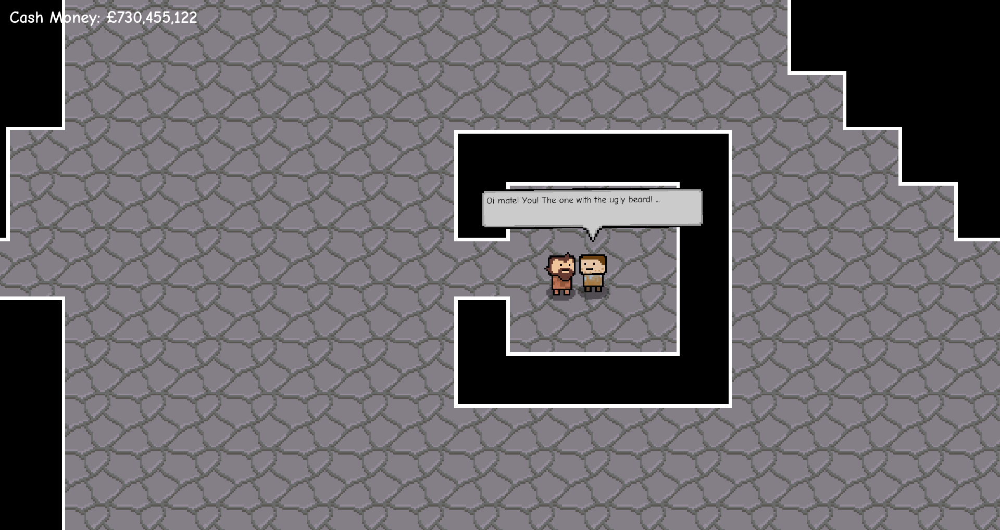
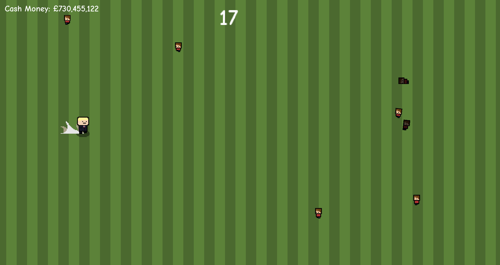
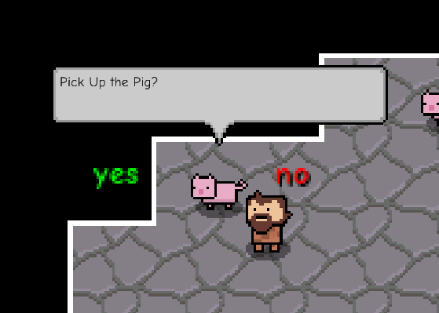

# gregynogGameJam
This is an RPG kinda game that was made in 2 days for a game jam. The theme of the game jam was "An effective method for selecting a prime minister", therefore this project includes some political themes and humour. This was my first project in godot and so there is a lot that could've been improved. 

## Things of note
- NPC scene which was extended to make many different kinds of interactions.
- Multiple endings with the ability to change the ending dialouge depending on the user's actions.
- Minigames implemented as godot scenes.
- ~10mins of gameplay

## Things That Would've Been Nice to Add
- Pigs reuse code, this is because during the creation of the game we didnt know how to make them into a scene as they already extended the NPC scene.
- Structure the game better to make saving data easier.
- Add more minigames and random encounters.

## Some Screenshots

